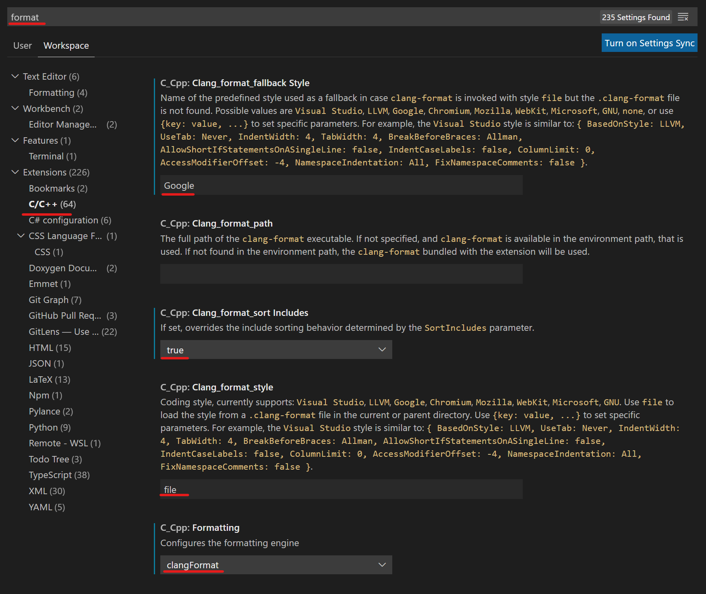
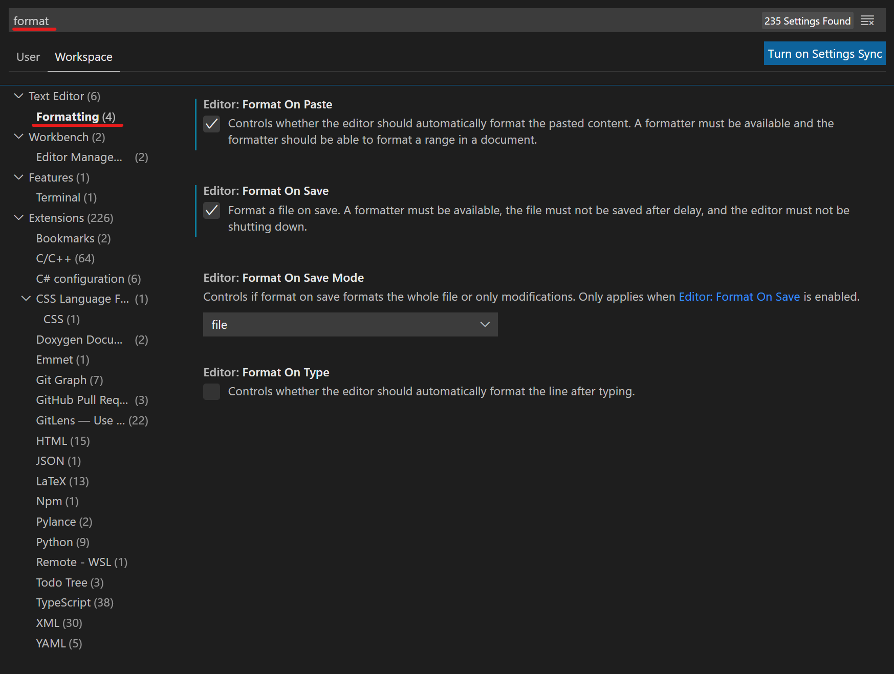

# How to use our formatter

In Ray-X we decided on using a formatter to keep our code clean and organized. Here you can read how to use it.

## General

We use clang-format for this purpose. The style is defined in the .clang-format file in the project root. As you can see in the file, our style is based on the Google C++ style. Remember: the formatter just completes our style guide and doesn't replace it.

## Visual Studio Code

If you are using Visual Studio Code you can use the C/C++ extension for formatting. It includes the clang-format binary so you just need to change a few settings to configure it correctly. You can see the changes (highlighted in red) in the following screenshots:



The following settings control, when the formatting should happen. This is up to you as long as the commited code is formatted.



### Using _Format All Files in Workspace_
To format all the workspace at once, you can use the following [Visual Studio Code's Extension](https://marketplace.visualstudio.com/items?itemName=alexr00.formatallfilesinworkspace).

In your settings .json file, add the lines to go through the correct directories and only format C++ files:

```
    "formatAll.includeFileExtensions": [
        ".cpp",
        ".h"
    ],
    "formatAll.excludeFolders": [
        "build",
        "Extern",
    ], 
```

*WARNING*: Using this extension can take up some time, you'll see all targeted files opening in new tabs. Grab a cup of coffee and let it do the trick :)

## Vim Integration

[ClangFormat — Clang 13 documentation (llvm.org)](https://clang.llvm.org/docs/ClangFormat.html#vim-integration)

