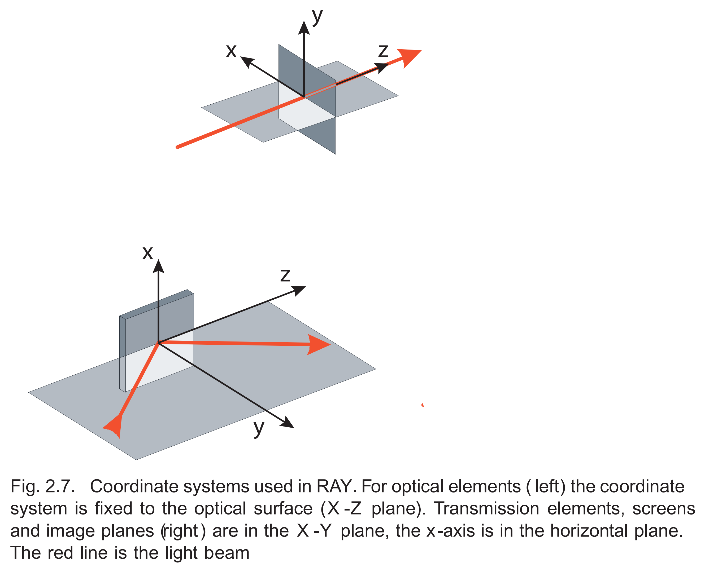
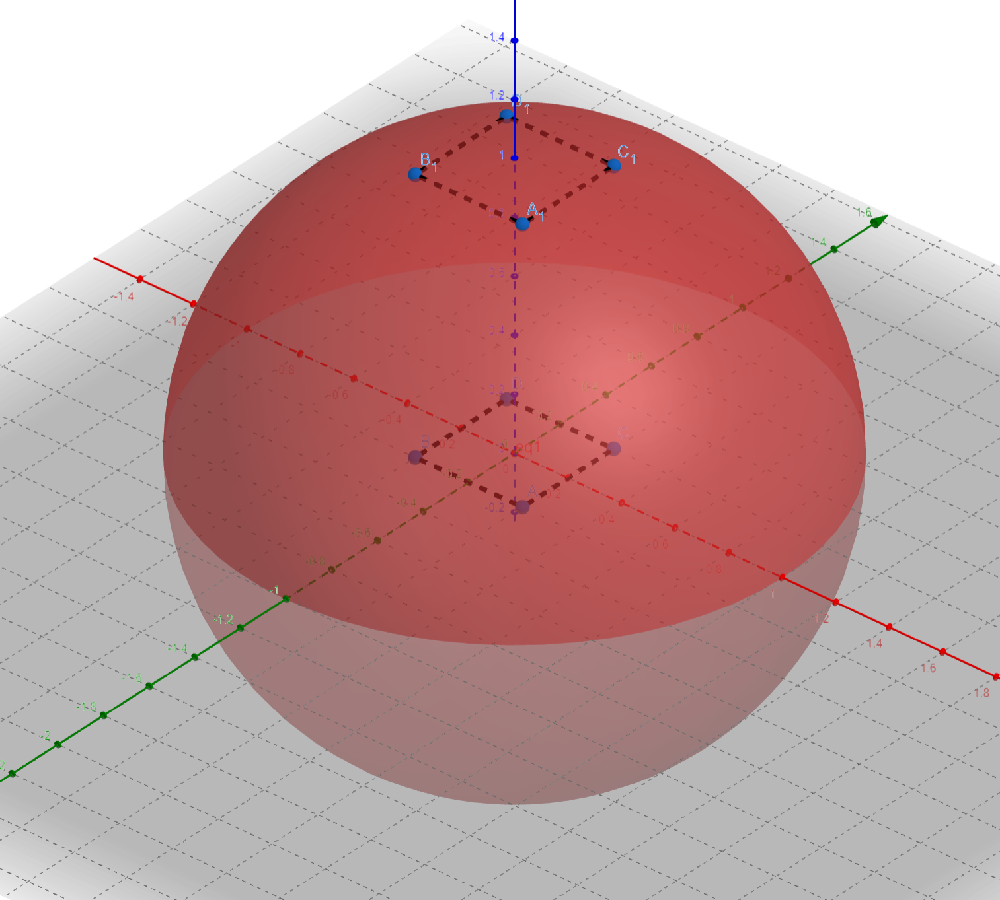

# Optical Elements

Optical elements are a central part of the tracing process. They define how light is guided through the beamline—where it is focused, redirected, or scattered. In this section, you can read up on the design choices we made when implementing optical elements in RAYX.

## Orientation

Optical elements in RAYX are conceptualized as shown below:

_Source: [Schaefers](https://gitlab.helmholtz-berlin.de/RAY/RAY/-/wikis/uploads/bdcf4515e03b2fccf462c5f0d76052c3/Paper_Schaefers_RAY_Springer_2007.pdf)_

The rule to keep in mind here is that if rays pass through an optical element, the element is placed in the XY-Plane; otherwise, it is in the XZ-Plane. The reasoning behind this is that the default direction of rays is always along the z-axis. This simplifies the design of beamlines, which mostly proceed in a straight line.

To orient the optical element within the entire beamline, we can simply adjust the direction matrix. Defining the basis vectors of the direction matrix provides full control over the orientation of the optical elements/surfaces.

## Behavior, Cutout, Surface

Merely defining the orientation of an optical element does not endow it with the optical properties relevant to beamline design. This is where behavior, cutout, and surface come into play. Every optical element possesses one of each. Behavior defines how the element interacts with light, surface outlines the shape of the element, and cutout specifies which part of the surface is relevant.

### Surface

Surfaces in RAYX are defined as either a plane, a quadric, or a toroid. We use mathematical formulas to represent them internally, which means they are not necessarily bounded in size. Optical elements are often subtly shaped; to the human eye, they might appear indistinguishable from planar elements.

### Cutout

The cutout specifies a particular part of the surface that constitutes the optical element. Cutouts can have different shapes:

- Rectangle
- Ellipse
- Trapezoid
- Unlimited

Internally, we distinguish among these elements to interpret them accurately during the tracing process. For example, an isosceles trapezoid has two widths and a height, while a rectangle has just a width and a height.

You may find variations in terminology in RML files. Height, width, and length are all used, perhaps inconsistently at the moment. Length usually defines the dimension along the z-axis, and width along the x-axis.

The cutout itself does not have a position; it is always at the origin of the element's coordinate system. For some shapes, this rule might not adequately define the position. Therefore, we use the `icurv` parameter to determine whether the surface is concave or convex. This suffices since we calculate all intersection points with elements. When two intersections occur, the `icurv` parameter informs us which intersection point to select.

### Behavior

Behavior determines whether an optical element is a slit, grating, RZP (special grating), mirror, or other. This classification aids the tracing process by specifying how rays will interact with the object. Ray interactions with elements are categorized as events. Here are some types of events (for more, see the Doxygen documentation):

- Fly off: The ray did not intersect with an element and will not be traced further.
- Just hit: The ray did intersect with an element and will continue to be traced.
- Absorbed: The ray was absorbed by the element and will not be traced further.

### How They Are Combined

In the following image, you can see a visualization of how the surface and cutout interact. The surface is a quadric that defines a sphere. The cutout is a rectangle, defined by points \\(A\\), \\(B\\), \\(C\\), and \\(D\\). Coupled with the `icurv` parameter, the cutout is mapped to the correct side of the sphere, visualized by points \\(A_1\\), \\(B_1\\), \\(C_1\\), and \\(D_1\\). If a ray intersects the element's surface within the bounds of the cutout, it will be counted as a hit. This is, where the behaviour comes into play to calculate the continuing path of the ray.

