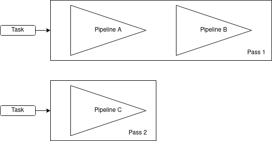
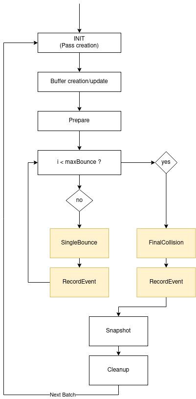

# Vulkan multi-shaderfile support: Shader split

## Why?
The current compute task in RAYX is crammed into one `main.comp` compute shader file. This shader file takes care of all the computation and runs all neccessary tracing operations (bounces, collision check, etc.). As expected though, this file is huge in size, even compared to the state of the art compute shaders. As a consequence, loading this file into the GPU as instructions through Vulkan takes a while.

Moreover, although including one file, launching the task once and idle waiting are easy, massive flexibility and granuanilty are lost. Once the compute task starts, the CPU receives messages from the GPU only once this task has finished or failed. In the meantime, the GPU is a blackbox! To ensure correct result storage, the VRAM needs to allocate enough space for all recorded events, which leads to the output buffer's exponential increase in memory usage. 

## How to solve? 
The Vulkan Engine needs to undergo a refactor, so that it can create multiple compute tasks coming from different shader files. We only traget "path tracing" and already have the whole procedure in main.comp. A good start would be to split this shader file into coherent smaller files, which might help make the engine's tasks easier to handle. This would first reduce the size of each task therby help the GPU Scheduler and reduce the register load inside every Core (Nvidia SM Core). By dispatching smaller similar tasks to the GPU, these tasks are bound to finish sooner and more likely to be executed in parallel, as opposed to having idle cores due to register bottlneck or missing cache as reported by Nvidia Nsight tools in singular shader file. 

Futhermore, this enables more debugging features as we gain more control over the control flow of the tracing algorithm. But also, the output buffer can be merged with the input buffer and read to fetch results every time a new "mini-task" has finished. The engine is supposed to treat a specific chunk of data, so it makes senes to send the data to GPU and read it back at every checkpoint, while the GPU can execute more tasks on the same data.

### VKPipeline
AFAIK, a shader `VkShaderModule` can only be bound through a unique pipeline `VkPipeline`. Hence this refactoring will center itself around this principle in the goal of making an easy-to-understand API that still doesn't require much user input. 

## How it works

### A Pass is group of Pipelines
The Vulkan Engine is made out of multiple passes. A (compute) Pass is the main class for executing a compute Program(Shader). Every Pass can have a group of pipelines to be executed sequentially. Each Pipeline is bound to a shader file. 

Let's suppose, we have Task A, B, and C to be executed on the GPU. If A and B can be ran sequentially, but C needs some CPU intervention before being also executed on GPU, then a possible composition would be to `createComputePipelinePass()` with A and B in the same Pass (containing 2 pipelines/shaders) and another Pass with only C. A Compute Command recorded for the first Pass will execute for both A and B. Another one is needed for C.



### Flow management 
To follow vulkan usage styles, the vulkan engine is initiliazed once. Then, as we use a batching system, we prepare the Passes (descirptor updating, necessary buffer reallocation, etc. ), run the the required compute task, cleanup, and repeat.



### Memory management
For buffer-descriptor-Pass binding, a new `BufferHandler` is created. This manages and prepares the buffers needed for the compute tasks.

The `BufferHandler` binds, following vulkan rules, the buffers to the correct pass, makes sure that the needed size is available and takes care of the transfer and write operation from and to the GPU.

A new buffer is created `ray-meta` which contains unique data to each ray (seed, ctr or state). This data also persists between bounces. 

## Pros and Cons
### Pros:
- Multiple shader files:

    The engine supports more than one shader file, which was the main goal at the beginning. It is now easy to introduce a new shader into the engine, for example ray generation-only tasks, sorting and ray marching.

- More flexibility and ease of debugging: 
    
    The vulkan engine now has more features and much more function calls that makes implementing new ideas faster. It is easier now to fetch more information from the GPU, since the CPU gets more messages in return (every bounce).

- Less memory usage:

    The same buffer `ray-buffer` is now input and output. The output-only buffer is removed. The size of this buffer is `rayAmount` instead of being `rayAmount*maxBounces`.

- More openings for optimization and parallelism. [Looks at Vulkan-Beyond page]

- Most of the classes (Pipelines, shaders, buffers, descriptors) are written in a way that graphic pipelines can also be supported (With more code obviously)

- OOP, destruction, and vulkan cleanup

    The new engine moves away from the C-style Vulkan version and creates objects with constructs, smart-pointers and destructors. As a consequence, memory leaks are less bound to happen and syntax is clearer. For example:
    ```
    // Create a buffer with rayList content
    bufferHandler
            ->createBuffer<Ray>({"ray-buffer", VKBUFFER_INOUT}, rayList); 
    ```

    ```
    // @brief Use ComputePipelineCreateInfo to build a new computePipeline
    struct ComputePassCreateInfo {
        const char* passName;
        std::vector<Pass::PipelineCreateInfo> pipelineCreateInfos = {};
        int descriptorSetAmount = 1;
    };
    ```

    ```
    // Explicit passes cleanup
    for (auto pass : m_computePasses) {
        for (auto& pipeline : pass->getPipelines()) {
            pipeline->cleanPipeline(m_Device);
        }
    }
    ```

### Cons

- The internal vkAPI is now a relatively harder to understand as we offer the user more power with compute tasks.
- More advanced vulkan synchronization (Fences, multi-pass etc.) are used, which means more pitfalls.
- The new version is slower as it relies more on I/O Transfers from and to the GPU. However, this can be analyzed and further optimized. We believe that this version has potential to run faster then original single-shader version.
- Some vulkan aspects are obviously not optimized, but are ignored as this was planned to be an easy-to-understand prototype: (Descirptors are all still bound to once set, Pushconstants are global and still do not support multi-pass system)
- Unknown undefined behaviour (Hence this shader is not merged)


## Conclusion
This was rather a successful experiment. I (_OS_) learned much more about Vulkan and GPUs. Once it is time to work on the vulkan engine in RAYX. This is by far, a high priority.
